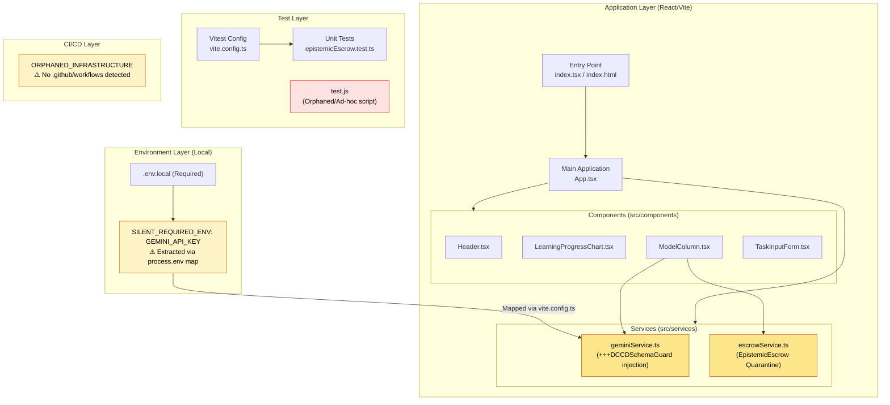

# TIER 2: Architecture Topology Map

Generated via Mycelial CI Trace (DRP_7_PATTERN_MODEL).
**Betti-1 Cycle Status**: CLEAN (No circular dependencies detected in static analysis)
**Dependency Graph Depth**: 4 (max: 8)

