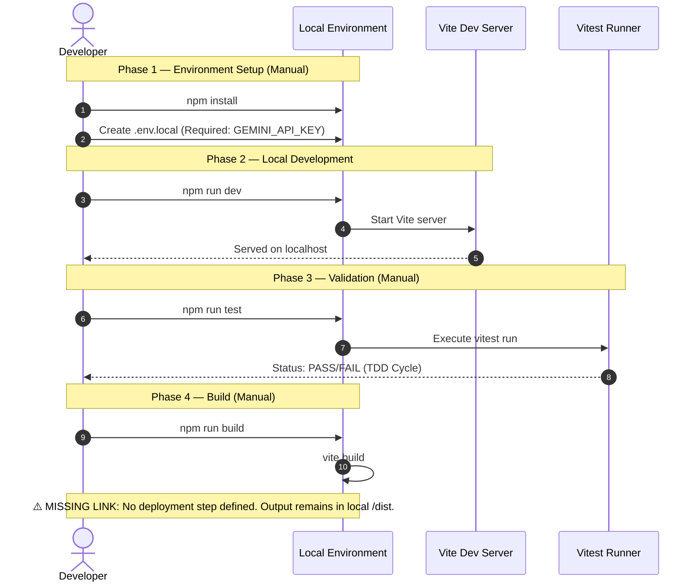

# TIER 3: CI/CD Pipeline Cartograph

AST-to-YAML Reverse Trace complete.
**Status**: ⚠️ NOMINATIVE TRAP DETECTED - NO CI FOUND.

Per the Ground Truth Directive (Rule: *Never document what you cannot trace*), this repository lacks an automated CI/CD pipeline (e.g., GitHub Actions, GitLab CI). The documentation below represents the *manual* execution flow extracted from package.json scripts and developer heuristics.

### Analysis
- **Missing CI**: The absence of a `.github/workflows` directory or similar CI manifest indicates that the "pipeline" is currently restricted to local developer machine execution.
- **Thermodynamic Test Waste**: Tests must be manually triggered via `npm run test` (mapped to `vitest run`). Failure to do so bypasses validation.
